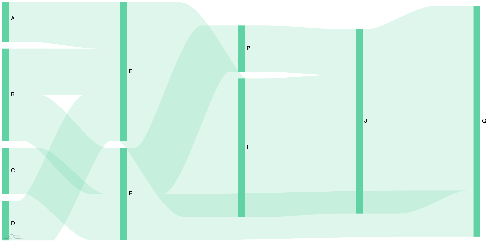
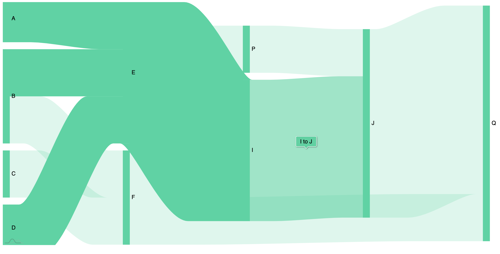

# Data Dependencies Sankey Diagram

Here is something I made as a weekend pet project. 
At work we have a complex and varied data points that travel through amny microservices and hence I intend to use this as a way to show that. 
Obviously this just shows non-business data but I hope you can see why it is useful. 

## Screenshots

## Usage

This was intentionally challenged to be a static webpage and only use amCharts libraries as to reduce security concerns, and as an experiement with the amCharts layer on top of d3 - which I came to really like for its simplicity.

As it is one static page it is not neat. You will find a section called raw. All you need to do is say where items connect to and from. My code will do the rest: decide on values for legibility, organise the downstream highlighting pattern, append colour information, restructure the data, etc. 

## Future work
* Neaten the code and make legible
* multi-select
* Better colour pick
* Widen the canvas to allow for meaningful dragging of nodes into groups